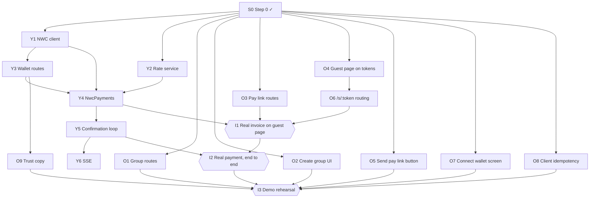

# Build plan

Two tracks that meet at one seam, `PaymentBackend.start(settlement)`.

- **Yash — the money path.** NWC, quotes, confirmation. Tests against a real wallet with small sats.
- **Om — the product surfaces.** Groups, pay links, the guest page, the connect screen. Builds against `MockClient` and `SimulatedPayments`, so it never waits on Lightning.

Step 0 is done: route modules split by owner, numbered migrations, the new contracts in `@sattle/core` and `SattleClient`, working `MockClient` versions of every new method, 501 stubs on the server, and CI.

## Dependency graph

**Critical path:** Y1 → Y4 → Y5 → I2 → I3. Lightning is the unknown, so Yash starts on Y1 immediately. On Om's side the link has to open the page, so O3 → O4 → O6 feed I1.

## Tasks

Each task is one branch and one PR. "Done when" is what the reviewer checks.

### Yash

| ID | Task | Needs | Files | Done when |
|---|---|---|---|---|
| Y1 | NWC client: parse the URI, `get_info`, `make_invoice`, `lookup_invoice` | S0 | `apps/api/src/nwc.ts` | A script mints a real invoice on the test wallet and reads its status back |
| Y2 | Rate service: live INR/BTC, 30s cache, fixed-rate fallback | S0 | `apps/api/src/rates.ts` | Returns a rate offline (fallback) and online (cached); unit tested |
| Y3 | Wallet routes: `PUT`/`GET /me/wallet`, store the URI secret, mark the user's members `nwc_linked` | Y1 | `routes/wallet.ts`, `migrations/003_wallet_connections.sql` | 501 tests replaced; a URI granting `pay_invoice` shows up in `excessMethods`; the URI never appears in a response or log |
| Y4 | `NwcPayments implements PaymentBackend`: quote, `make_invoice` on the payee's connection, store `payment_hash` | Y1 Y2 Y3 | `payments/nwc.ts`, `migrations/004_payment_hash.sql`, `server.ts` | `PAYMENTS=nwc` makes a settlement reach `awaiting_payment` with a real BOLT11 |
| Y5 | Confirmation loop: poll `lookup_invoice`, check `sha256(preimage) == payment_hash`, mark `confirmed`/`expired`, resume on boot | Y4 | `payments/nwc.ts`, `server.ts` | Paying from a phone flips the settlement to `confirmed` within 5s; restarting mid-payment still confirms |
| Y6 | SSE for settlements and guest views, polling kept as fallback | Y5 | `routes/events.ts`, `ApiClient.ts` | The UI shows `awaiting_payment`, which polling skips today |

### Om

| ID | Task | Needs | Files | Done when |
|---|---|---|---|---|
| O1 | `POST /groups`, `POST /groups/:id/members` | S0 | `routes/groups.ts`, `repo.ts` | 501 tests replaced; the creator is `joined` and claimed, the others are ghosts |
| O2 | New-group and add-member UI | S0 | `ui/` | Works on the mock; works on the API once O1 lands |
| O3 | Pay links: create, `POST /s/:token/open`, `GET /s/:token`, seed `fixtures.payLinks` | S0 | `routes/payLinks.ts`, `migrations/002_pay_links.sql`, `db.ts` seed | Every branch in the route comment has a test; `/s/` responses contain no member or group ids |
| O4 | Guest page on tokens: `openPayLink` then `onGuestViewUpdate`, a real QR, failed/expired/`link_expired` states | S0 | `ui/GuestPayScreen.tsx` | All states reachable on the mock (`alwaysFailSettlement`, unknown token, settled debt) |
| O5 | "Send pay link" on a debt you're owed, plus the share sheet | S0 | `ui/GroupDetailScreen.tsx` | Only shows on debts owed *to* you; shares `${APP_URL}/s/<token>` |
| O6 | Opening `/s/<token>` in a browser lands on the guest page | O4 | `App.tsx` / router | Pasting the link into a fresh browser tab shows the page, with no app state |
| O7 | Connect-wallet screen: paste an NWC string, show the granted methods, warn on `excessMethods` | S0 | `ui/WalletScreen.tsx` | Works on the mock; the real `get_info` result shows once Y3 lands |
| O8 | Idempotency keys come from the user action, not the request | S0 | `ApiClient.ts`, `useSettleFlow.ts` | A retry after a network error reuses the key (test with `failureRate`) |
| O9 | Trust screen copy matching what the server actually holds | Y3 | `ui/WalletScreen.tsx` | Yash has reviewed every claim against the code |

### Together

| ID | Milestone | Needs | Done when |
|---|---|---|---|
| I1 | A real invoice on the guest page | Y4 O3 O6 | A link opened on a second phone shows a real QR code from the test wallet. **Target: end of day 1.** |
| I2 | A real payment, end to end | Y5 I1 | Pay from a phone, and the guest page and the group screen both flip to settled. Run it 10 times. |
| I3 | Demo rehearsal | I2 + every O task | The 3-minute script runs clean twice in a row; the backup video is recorded |

## Suggested order

| | Yash | Om |
|---|---|---|
| Day 1 AM | Y1, Y2 | O3, O4 |
| Day 1 PM | Y3, Y4 | O6, O5 |
| **Day 1 evening** | **I1 together** | **I1 together** |
| Day 2 AM | Y5, Y6 | O1, O2, O7, O8 |
| Day 2 PM | I2, fixes | O9, polish |
| Day 2 evening | I3 together | I3 together |

## Rules

- **Contracts change by conversation.** Anything in `@sattle/core` or `SattleClient` is shared; say so before you change it.
- **New interface method → `MockClient` in the same PR.** The app must always run with `npm run web`.
- **Schema changes are new migration files.** Never edit one that's on `main`. Numbers: Om 002, Yash 003–004; take the next free one after that.
- **Stay in your own files.** If you need to change the other person's, message first.
- **Replace the 501 test when you build a stub.** `contract.test.ts` lists every stub that's still open.
- **Never commit the NWC test string.** Keep it in a shared password manager and pass it in through `apps/api/.env`.
- **Merge to `main` at least twice a day.** CI runs typecheck and tests on every PR.
