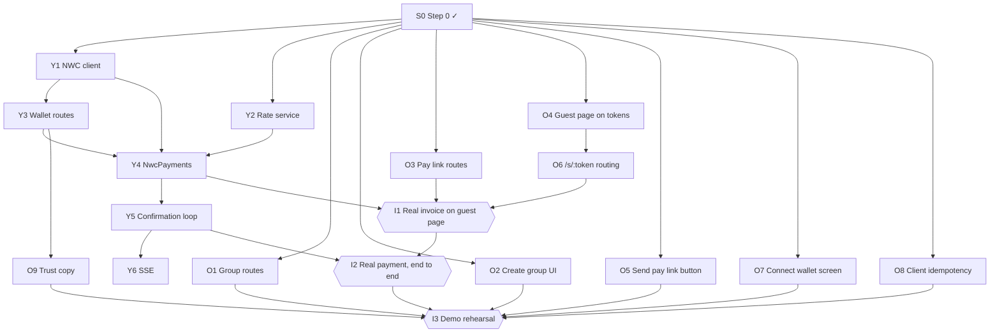
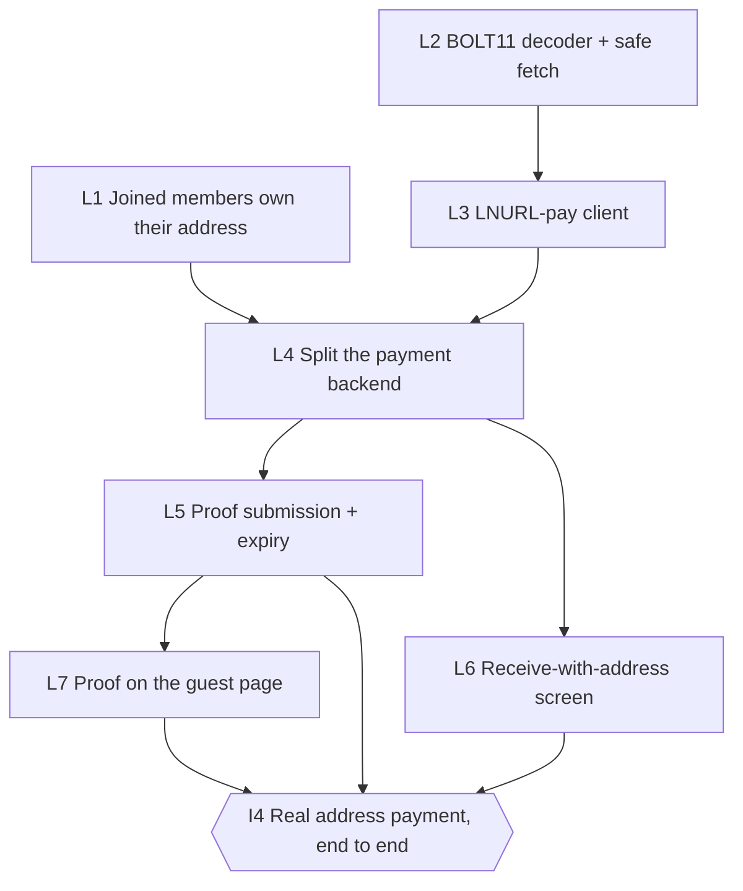

# Build plan

Two tracks that meet at one seam, `PaymentBackend.start(settlement)`.

- **Yash — the money path.** NWC, quotes, confirmation. Tests against a real wallet with small sats.
- **Om — the product surfaces.** Groups, pay links, the guest page, the connect screen. Builds against `MockClient` and `SimulatedPayments`, so it never waits on Lightning.

Step 0 is done: route modules split by owner, numbered migrations, the new contracts in `@sattle/core` and `SattleClient`, working `MockClient` versions of every new method, 501 stubs on the server, and CI.

## Dependency graph

**Critical path:** Y1 → Y4 → Y5 → I2 → I3. Lightning is the unknown, so Yash starts on Y1 immediately. On Om's side the link has to open the page, so O3 → O4 → O6 feed I1.

## Tasks

Each task is one branch and one PR. "Done when" is what the reviewer checks.

### Yash

| ID | Task | Needs | Files | Done when |
|---|---|---|---|---|
| Y1 | NWC client: parse the URI, `get_info`, `make_invoice`, `lookup_invoice` | S0 | `apps/api/src/nwc.ts` | A script mints a real invoice on the test wallet and reads its status back |
| Y2 | Rate service: live INR/BTC, 30s cache, fixed-rate fallback | S0 | `apps/api/src/rates.ts` | Returns a rate offline (fallback) and online (cached); unit tested |
| Y3 | Wallet routes: `PUT`/`GET /me/wallet`, store the URI secret, mark the user's members `nwc_linked` | Y1 | `routes/wallet.ts`, `migrations/003_wallet_connections.sql` | 501 tests replaced; a URI granting `pay_invoice` shows up in `excessMethods`; the URI never appears in a response or log |
| Y4 | `NwcPayments implements PaymentBackend`: quote, `make_invoice` on the payee's connection, store `payment_hash` | Y1 Y2 Y3 | `payments/nwc.ts`, `migrations/004_payment_hash.sql`, `server.ts` | `PAYMENTS=nwc` makes a settlement reach `awaiting_payment` with a real BOLT11 |
| Y5 | Confirmation loop: poll `lookup_invoice`, check `sha256(preimage) == payment_hash`, mark `confirmed`/`expired`, resume on boot | Y4 | `payments/nwc.ts`, `server.ts` | Paying from a phone flips the settlement to `confirmed` within 5s; restarting mid-payment still confirms |
| Y6 | SSE for settlements and guest views, polling kept as fallback | Y5 | `routes/events.ts`, `ApiClient.ts` | The UI shows `awaiting_payment`, which polling skips today |

### Om

| ID | Task | Needs | Files | Done when |
|---|---|---|---|---|
| O1 | `POST /groups`, `POST /groups/:id/members` | S0 | `routes/groups.ts`, `repo.ts` | 501 tests replaced; the creator is `joined` and claimed, the others are ghosts |
| O2 | New-group and add-member UI | S0 | `ui/` | Works on the mock; works on the API once O1 lands |
| O3 | Pay links: create, `POST /s/:token/open`, `GET /s/:token`, seed `fixtures.payLinks` | S0 | `routes/payLinks.ts`, `migrations/002_pay_links.sql`, `db.ts` seed | Every branch in the route comment has a test; `/s/` responses contain no member or group ids |
| O4 | Guest page on tokens: `openPayLink` then `onGuestViewUpdate`, a real QR, failed/expired/`link_expired` states | S0 | `ui/GuestPayScreen.tsx` | All states reachable on the mock (`alwaysFailSettlement`, unknown token, settled debt) |
| O5 | "Send pay link" on a debt you're owed, plus the share sheet | S0 | `ui/GroupDetailScreen.tsx` | Only shows on debts owed *to* you; shares `${APP_URL}/s/<token>` |
| O6 | Opening `/s/<token>` in a browser lands on the guest page | O4 | `App.tsx` / router | Pasting the link into a fresh browser tab shows the page, with no app state |
| O7 | Connect-wallet screen: paste an NWC string, show the granted methods, warn on `excessMethods` | S0 | `ui/WalletScreen.tsx` | Works on the mock; the real `get_info` result shows once Y3 lands |
| O8 | Idempotency keys come from the user action, not the request | S0 | `ApiClient.ts`, `useSettleFlow.ts` | A retry after a network error reuses the key (test with `failureRate`) |
| O9 | Trust screen copy matching what the server actually holds | Y3 | `ui/WalletScreen.tsx` | Yash has reviewed every claim against the code |

### Together

| ID | Milestone | Needs | Done when |
|---|---|---|---|
| I1 | A real invoice on the guest page | Y4 O3 O6 | A link opened on a second phone shows a real QR code from the test wallet. **Target: end of day 1.** |
| I2 | A real payment, end to end | Y5 I1 | Pay from a phone, and the guest page and the group screen both flip to settled. Run it 10 times. |
| I3 | Demo rehearsal | I2 + every O task | The 3-minute script runs clean twice in a row; the backup video is recorded |

## Suggested order

| | Yash | Om |
|---|---|---|
| Day 1 AM | Y1, Y2 | O3, O4 |
| Day 1 PM | Y3, Y4 | O6, O5 |
| **Day 1 evening** | **I1 together** | **I1 together** |
| Day 2 AM | Y5, Y6 | O1, O2, O7, O8 |
| Day 2 PM | I2, fixes | O9, polish |
| Day 2 evening | I3 together | I3 together |

## Rules

- **Contracts change by conversation.** Anything in `@sattle/core` or `SattleClient` is shared; say so before you change it.
- **New interface method → `MockClient` in the same PR.** The app must always run with `npm run web`.
- **Schema changes are new migration files.** Never edit one that's on `main`. Numbers: Om 002, Yash 003–004; take the next free one after that.
- **Stay in your own files.** If you need to change the other person's, message first.
- **Replace the 501 test when you build a stub.** `contract.test.ts` lists every stub that's still open.
- **Never commit the NWC test string.** Keep it in a shared password manager and pass it in through `apps/api/.env`.
- **Merge to `main` at least twice a day.** CI runs typecheck and tests on every PR.

## Next: receive with a Lightning address

Today only someone with an NWC wallet can receive real payments, and most wallets people already have can't do NWC (Wallet of Satoshi, Phoenix, Blink and others). This lets someone receive by typing a Lightning address instead. The server asks the address for an invoice the same way any wallet does. NWC stays as it is.

Knowing it was paid, in order of preference:

1. **Poll.** The provider returns a verify URL (LUD-21) and we poll it. 6 of the 16 providers tested do: Alby, Blink, Zeus Pay, Minibits, Speed, Stacker News.
2. **Proof.** For the rest, a browser wallet hands back the preimage (WebLN `sendPayment`), or the payer pastes it.
3. **Manual.** The person owed marks it settled, as today.

Polling and proof are both checked with `preimageMatches` against the payment hash we stored when we fetched the invoice, so they are as strong as the NWC path. **That only holds if the person owed chose the address**, which is why L1 comes first.

### Why L1 comes first

A preimage proves an invoice was paid, not that the money reached the person owed. With NWC the server mints on the payee's own wallet, so the two are the same. With an address, the server trusts whoever typed it, and today:

- anyone in the group can set a ghost's address (`routes/groups.ts`, `PUT /members/:id/payout-address`), and
- `claimMember` keeps that address when the ghost joins.

So a payer can put their own address on a ghost, wait for the ghost to join, pay themselves, and get a valid proof. Harmless today (the address rail is only offered for ghosts, and the payer can already mark a ghost's debt settled), but a fake `confirmed` once this ships.

### Dependency graph

**Critical path:** L2 → L3 → L4 → L5 → I4. L1 has no dependencies and ships first on its own.

### Tasks

Each task is one branch and one PR. "Done when" is what the reviewer checks.

#### Yash

| ID | Task | Needs | Files | Done when |
|---|---|---|---|---|
| L1 | Joining clears the address a groupmate typed, and migration 009 clears the ones joined members already inherited. A joined member's address is then always one they set (the route already stops others changing it), so no extra column is needed. | — | `migrations/009_address_owner.sql`, `repo.ts`, `MockClient.ts` | Test: a groupmate sets their own address on a ghost, the ghost joins, the address is gone and only the member can set a new one |
| L2 | BOLT11 decoder (payment hash, amount, description hash, expiry). Safe fetch: https only, private and loopback IPs blocked after DNS, no redirects, short timeout, size cap. | — | `apps/api/src/bolt11.ts`, `apps/api/src/safeFetch.ts` | Decodes invoices from every tested provider; fetch refuses `localhost`, `10.x`, `169.254.x`, a redirect, an oversized body |
| L3 | LNURL-pay client: read `/.well-known/lnurlp/<name>`, check min/max, request the invoice, check amount and `description_hash`, keep `verify` if present | L2 | `apps/api/src/lnurl.ts` | Tests on recorded responses from the 16 providers; a wrong amount or hash is refused |
| L4 | `NwcPayments` becomes one backend with two steps: get an invoice (NWC or address), confirm it (NWC lookup, LUD-21 verify, or wait for proof). A joined member with a self-set address and no NWC can receive on `invoice`. LUD-21 confirms only when the preimage matches. | L1 L3 | `payments/nwc.ts` → `payments/lightning.ts`, `migrations/011_address_invoices.sql`, `server.ts`, `settlementOptions.ts` (core) | Existing NWC tests pass unchanged; `PAYMENTS=nwc` mints from a real address and confirms over verify |
| L5 | Proof submission: `POST /groups/:id/settlements/:sid/proof` (authed payer) and `POST /s/:token/proof` (guest), both through `preimageMatches`. A proof can confirm an expired settlement. Without a verify URL, expiry closes the row as "unknown" with a message to paste proof or ask the payee. | L4 | `routes/settlements.ts`, `routes/payLinks.ts`, `payments/lightning.ts`, `SattleClient.ts`, `MockClient.ts`, `nostrLedger.ts` | A wrong preimage is refused; a right one confirms, also after expiry; the Nostr ledger records the late confirmation |

#### Om

| ID | Task | Needs | Files | Done when |
|---|---|---|---|---|
| L6 | "Receive with a Lightning address" on the wallet screen, next to NWC, with copy for providers we can't confirm automatically. The address belongs to the person, like the NWC connection, so one covers every group: `users.receive_address` and `/me/receive-address`, checked on save. | L4 | `ui/WalletScreen.tsx`, `routes/wallet.ts`, `migrations/012_receive_address.sql` | Works on the mock; on the API a saved address makes the member payable in every group |
| L7 | Guest page: a browser wallet pays and sends the proof back; otherwise a field to paste it | L5 | `ui/GuestPayScreen.tsx` | Both paths reachable on the mock; a pasted proof flips the page to settled |

#### Together

| ID | Milestone | Needs | Done when |
|---|---|---|---|
| I4 | A real address payment, end to end | L5 L6 L7 | One provider that supports verify and one that doesn't, both reach `confirmed` from a phone. Run each 5 times. |

### Review: secure, scalable, reliable

A second pass over the plan above before building it. Each item lands in the PR named, or as its own `R` task.

**Security**

| ID | Finding | Fix | Lands in |
|---|---|---|---|
| R1 | Nothing stops two settlements sharing a payment hash. An LNURL server that returns the same invoice twice would let one payment confirm two debts. | Unique index on `settlements.payment_hash` (NULLs allowed). Minting refuses a hash we already hold. | Own PR, before L4 |
| R2 | Checking the IP once and then connecting by name lets DNS rebinding reach internal addresses. | Resolve once, check every address, connect to the checked IP with the original `Host`/SNI. | L2 |
| R3 | Every pay-link open asks the payee's provider for an invoice. Anyone with a link can make us hammer a third party. | Opens are already refused while a payment for the pair is in progress. Add a cap on mints per address per minute, so an open–expire–reopen loop can't either. | L4 |
| R4 | A verify URL is a bearer for payment status. | Never in an API response, a guest view, a log line or the Nostr ledger. Store it, use it, nothing else. | L4 |
| R5 | A typed address can change while an invoice is open. | The settlement keeps the invoice, hash and verify URL it was minted with; a new address applies to the next one. | L4 |
| R6 | Proof bodies are user input. | Exactly 64 hex characters, checked before anything else; no other fields read. | L5 |

**Scalability**

| ID | Finding | Fix | Lands in |
|---|---|---|---|
| R7 | The confirmation loop polls every open invoice every 1.5s, all at once. Fine for NWC on our relay; rude to a third party's HTTP server and a waste for invoices nobody is paying. | Back off per invoice (1.5s, rising to 30s after the first minutes), cap concurrent requests per host, and stop polling providers without `verify` at all. | L4 |
| R8 | LNURL metadata is fetched on every mint. | Cache the `/.well-known/lnurlp` answer per address for a few minutes. | L3 |
| R9 | Open invoices are watched in one process's memory, so only one API instance can run. | Not needed yet. When it is: a lease column (`watched_by`, `lease_until`) so instances split the work. Written down so nobody adds a second instance by accident. | Later |

**Reliability**

| ID | Finding | Fix | Lands in |
|---|---|---|---|
| R10 | A slow provider could hang a mint. | Every outside call has a timeout; a failed mint fails the settlement with a message naming the provider, as NWC does. | L3 |
| R11 | A retried proof submit must not error. | Submitting the proof of an already confirmed settlement returns it as is. | L5 |
| R12 | Providers change their answers. | Tests run on recorded responses from each provider, plus an `lnurl:smoke` script like `nwc:smoke` that mints a real invoice from a real address. | L3 |

### Implementation order

Each line is one PR off `main`, on a `yash/` branch.

1. This plan.
2. L1: joined members own their address.
3. R1: unique payment hash.
4. L2: BOLT11 decoder and safe fetch (with R2).
5. L3: LNURL-pay client (with R8, R10, R12).
6. L4, L5, then Om's L6 and L7.

### Open decisions

Need answers before L2. (Whether to clear a groupmate's address on join was decided in L1: clear it.)

| Question | Options | Lean |
|---|---|---|
| BOLT11 decoder | Small vetted package, or our own (~80 lines of bech32) | Package, unless we want zero new dependencies |
| Late payment at a stale rate | Accept the proof anyway, or refuse and ask the payee | Accept: it's real money, and the drift is small |

### Rules

Same as [Rules](#rules) above. Migrations here take 009 to 012 (Om's group work took 007 and 008). L4 and L5 change `@sattle/core` and `SattleClient`, so they are contract changes: talk first.
